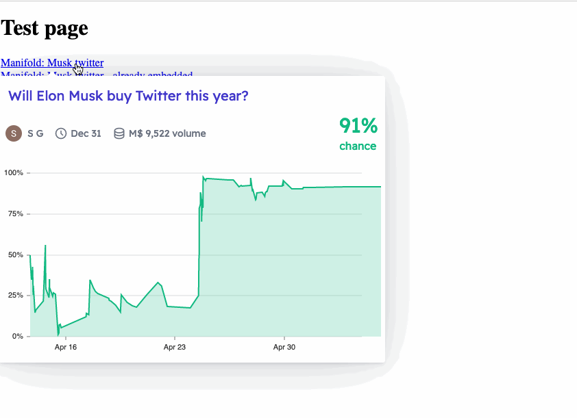

# Link Summoner


A script that you can embed in your website  to easily enable live link previews for a whitelisted set of websites.



### Usage

#### Script tag

The simplest option is to add the following tag to your page (update the version number if necessary):

```html
<script src="https://cdn.jsdelivr.net/npm/link-summoner@1.2.0/dist/browser.min.js" type="module"></script>
```

#### Using as a library (via NPM)

See example usage in [examples/bundling](./examples/bundling)

1. `npm install link-summoner`
2. In the files/pages you want to have live link previews:
```javascript
import {initPreviews} from "link-summoner"

initPreviews()
```

### Customization

See an extensive customization example in [Transclude Me extension](https://github.com/transclude-me/extension/blob/main/source/content/index.ts#L23) which is using this library as a foundation.

#### Styling

Links that can be previewed get the `link-with-preview` CSS class. You can specify styling for that class to indicate presence of the preview. For example, the following snippet would add `τ` after each link with preview:

```css
.link-with-preview::after {
	text-decoration: none;
	content: 'τ';
	margin-left: 0.2em;
	color: #4f5c68;
}
```

#### Whitelisting more websites/adding custom preview types

`initPreviews` function accepts a configuration object with the following properties:

- `linkPreviewClass: string` — CSS class that will be added to links that have the preview.
  - **Default**: `link-with-preview` 
- `renderers: LinkRenderer[]` - a list of renderers for live previews. 
  - **Default**: [`defaultRenderers`](./src/rendering/link-renderer.tsx#15) 
  - Each renderer must define 
    - `canRender(url: URL): Promise<boolean>` and 
    - `render(url: URL): Promise<HTMLElement>` methods.
  - There is also a set of pre-defined renderers you can reuse.
- `tippyOptions` - options for the [tippy.js](https://atomiks.github.io/tippyjs/) library which is used to show popups.
  - **Default**: [./src/tippy.ts](./src/tippy.ts)

**Example: add an iframe preview for `example.com`, while keeping all the default preview options:** 
```javascript
import {initPreviews, defaultRenderers, iframeRenderer} from "link-summoner"

initPreviews({
  renderers: [
      iframeRenderer(/example\.com/),
      ...defaultRenderers, 
  ]
})
```


### Supported websites

For the list of supported websites see files in [src/rendering](./src/rendering) 

### Usage in the wild:
- [Transclude Me extension](https://github.com/transclude-me/extension/)
- https://docs.manifold.markets
